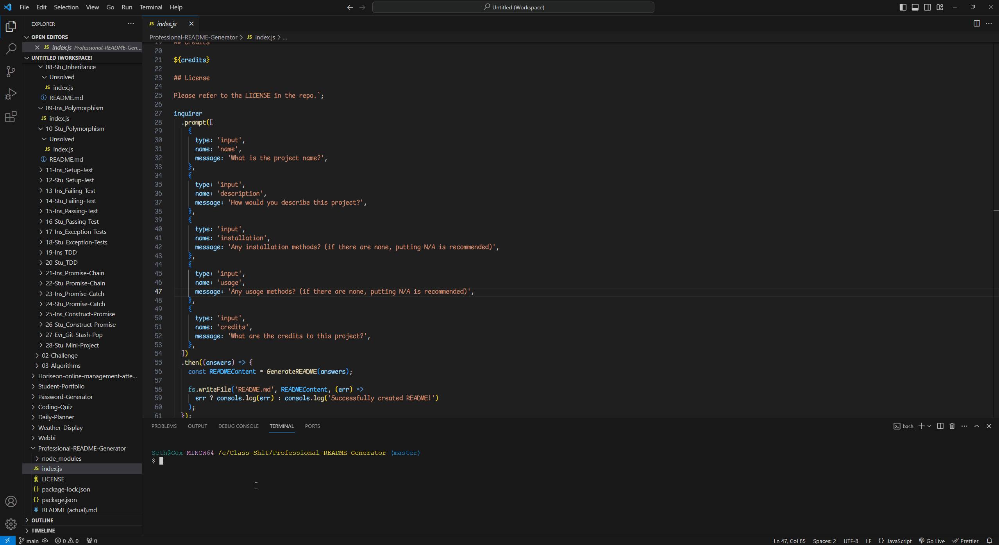

# README Generator

## Description

A professional README generator

## Installation

N/A

## Usage

Install Node.JS, then in your terminal navigate to the project folder and type "node index.js"

## Credits

Coded By: Seth Correa (Seth the Furboi)

## License

Please refer to the LICENSE in the repo.